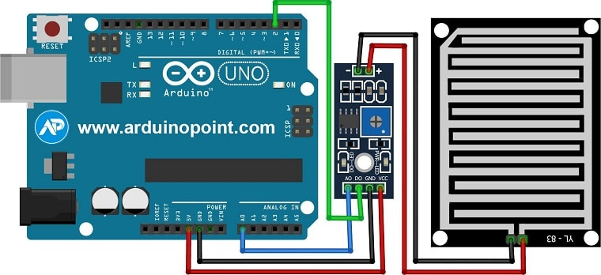

# C0050-Rain Sensor

The rain sensor module is used to detect rainwater and is widely used in weather monitoring systems, smart irrigation systems, and home automation systems. It consists of a rain board module and a control board module that work together to detect and convert analog values to digital values.

## Image

## How to connect to a circuit

The rain board module is connected to the control board module, which is then connected to the Arduino board. The VCC and ground pins of the control board are connected to the 5V and ground pins of the Arduino, respectively. The D0 and A0 pins of the control board are connected to any digital and analog pins of the Arduino, respectively. The buzzer can be connected to any digital pin of the Arduino.

## Theory behind the components

The rain board module consists of two copper tracks that offer high resistance to the supply voltage under dry conditions. As the wetness on the board increases, the resistance gradually decreases, resulting in a decrease in the output voltage of the module. The control board module controls the sensitivity and converts the analog output to digital output. If the analog value is below the threshold value of the control board, the output is digital high.

## Features

- The rain sensor module is easy to use and provides accurate detection of rainwater. 
- It is small in size and can be easily integrated into any circuit.
- It requires minimal power and is compatible with a wide range of microcontrollers.

## Statistics

- The rain sensor module is widely used in weather monitoring systems, smart irrigation systems, and home automation systems. 
- It is a popular choice among hobbyists and DIY enthusiasts due to its low cost and ease of use.
- With its accurate detection of rainwater, the rain sensor module helps in conserving water and preventing floods in low-lying areas.
