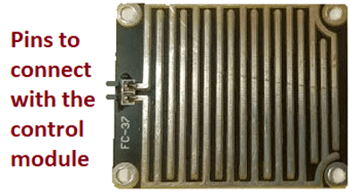
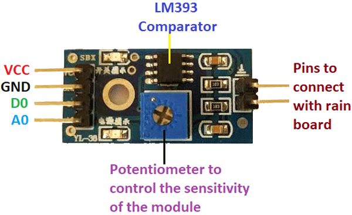
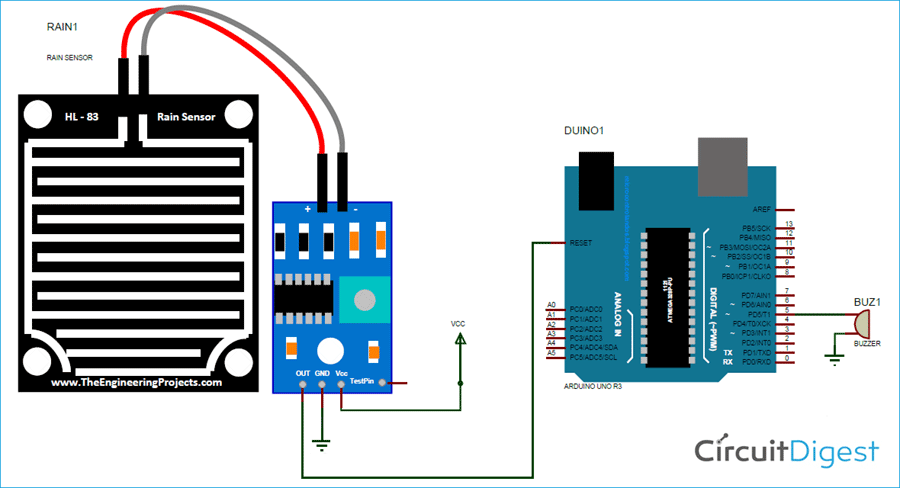

# Rain Sensor

- The Rain board module consists of two copper tracks,designed in such a way that under the dry conditions they provide high resistance to the supply voltage,and this output voltage of this module is 5V.
- This module's resistance gradually decreases with respect to an increase in the wetness on the board.
- As the resistance decreases,its output voltage also decreases with respect to the wetness on the module.
- The rain board module consists of two pins used to connect to the control board as shown below.

- Control Board module controls the sensivity and converts the analog output to digital output.
- If the analog value is below the threshold value of the control board,the output is degital high.
- The Rain Control module which is shown below consists of 4 pins to connect the Arduino namely VCC,GND,D0,A0 and two more pins to connect the rain board module.
- In summary,the rain board module detects the rainwater and the control board module is used to control the sensitivity and compare and convert the analog values to digital values.

## Working of Rain Sensor

- Working of the rain sensor module is simple to understand.
- During a sunny day, due to the dryness on the rain board module,it offers high resistance to the supply voltage.
- This Voltage appears on the output pin of the Arduino.
- During rain,the results in the decrease in the resistance offered for the supply.
- As the resistance decreases gradually,the output voltage starts to decrease.
- When the rain board is fully wet,and the resistance offered by it is minimum,the output voltage will be as low as posible.
- This 0V is read as 0 value if read by analog pin of the Arduino.
- If the rain board module is partially wet,the output of this rain board module will be with respect to the resistance it offers.
- If the resistance offered by the rain board module is in such a way that the output is 3V the read analog value will be 613.
- Formula to find ADC can be given by ADC=(Analog Voltage value X 1023)/5.
- By using this formula you can convert any analog voltage to Arduino analog read value.

## Circuit Diagram

- The below circuit diagram shows circuit connections for the Rain Drop Sensor with Arduino.

- This rain gauge module,which is shown in the circuit diagram is connected to the control board.
- The control board's VCC pin is connected to 5V supply.
- The ground pin is connected to ground.If needed,the D0 pin is connected to any digital pin of the Arduino and that pin must be decleared as an output pin in the program.
- The problem we face with the D0 pin  is that we can't get the exact value of the output voltage.
- If the output crosses the threshold voltage,then the control module can sense the changes in the output voltage in the rain board module.
- Due to these reasons,the A0 pin is connected to the analog pin of Arduino,which makes monitoring the changes in output easy.
- The buzzer,which is used as a signal to the user,can be connected to any digital pin of the Arduino.
- If the buzzer needs more than 5V,then try to connect a relay circuit or a transistor and then connecting the load to it.