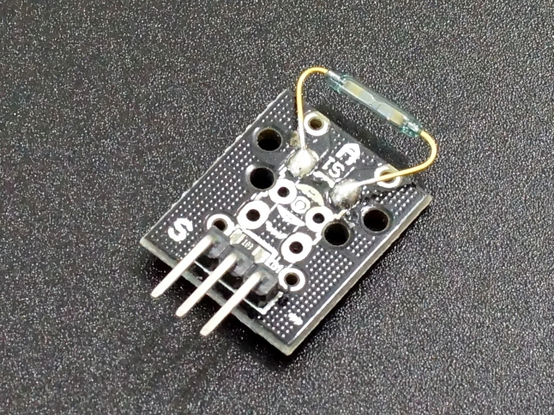
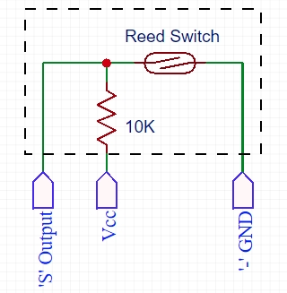
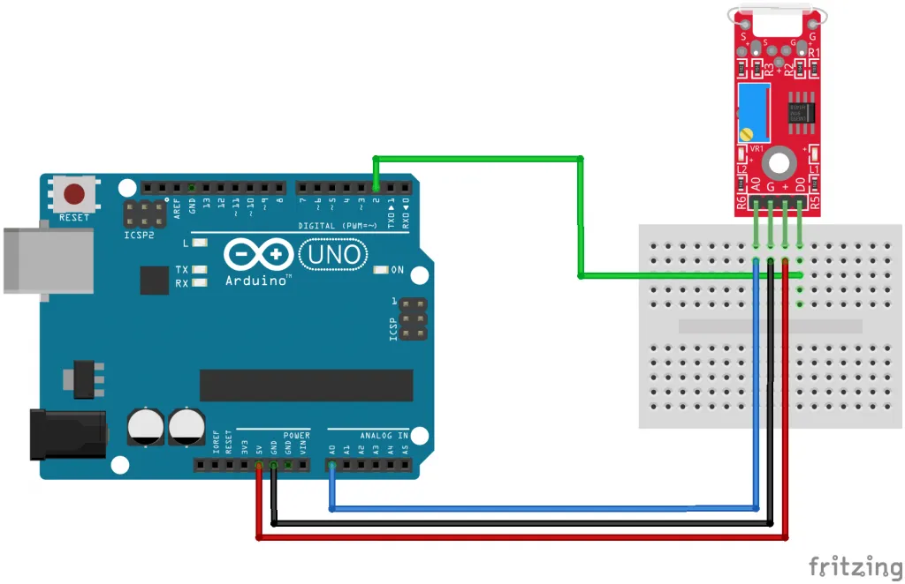

# Read Switch Module

- The Mini Switch Module activates a switch closure when a magnetic feild comes near.
- Reed switches are mechanical switches that are activated by a magnet when the magnetic feild pulls the matellic switch contacts together.
- Real world uses include applications such as home security where a reed switch is placed in proximity to a magnet when a window is closed.
- If the window is opened,the magnet moves away from the switch that causes it to change states which can then be detected by an MCU.
- This module is a SPST switch with NO (Normally Open)contacts until a magnet comes into close proximity to the glass envelope and then the switch contacts are closed.
- The output is HIGH when the switch is open and is grounded(LOW)when the contacts are closed.

## Module Connections

- There is a 3 pin header on the assembly.
- The GND pin is connected the Ground end of the switch and the 'S' output pin is connected to the other side of the switch.
- If a ohmmeter is places between these pins,the switch will read open.
- If a magnet is placed close to the glass envelope,the switch will close and the meter will read close to 0 ohoms.

- There are a 3rd unmarked pin in the center that connects to a 10K pull-up resistor.
- You can either tie this pin to VCC so that the pin will be pulled HIGH when the switch is open or you can enable an internal pullup on the pin that connects to the MCU.

