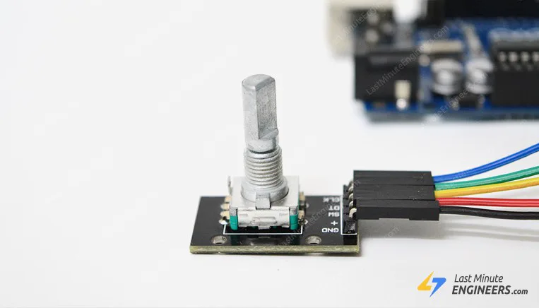

# Rotary Encoder Module

- We are surrounded by rotary encoders without even realizing it,as they are used in so many everyday items,from printers and cameras to CNC machine and ribots.
- The most common application of a rotary encoder is the volume knob on a car ardio.
- A rotary encoder is a type of position sensor that convert the angular position(rotation) of a knob into an output signal that can be used to determine which direction the knob is turned.
- Rotary encoders are classified into two types:absolute and incremental.
- The absolute encoders reports the exact position of the knob in degrees,whereas the incremental encoder reports the numbers of increments the shaft has moved.
## Rotary Encoders Vs Potentiometers
- Rotary encoders are the modern digital equivalent of potentiometers and are more versatile.
- Rotary encoders can rotate 360` without stopping,wheres potentiometers can only rotate 3/4 of the circle.
- Potentiometers are used in situations where you need to know the extract position of the knob.
- Rotary encoders,on the other hand,are used in situations where you need to know the change in position rather than the extact position.
## How Rotary Encoders Work?
- Inside the encoder is a slotted disc that is connected to pin C,the common ground.It also has two contact pins A and B,as shown below.
 

- When you turn the knob,A and B make contact with common ground pin C in a specific order depending on which direction you turn the knob.
- When they make contact with common ground,two signals are 90` out of phase because one pin makes contact with common ground before the other.It is referred to as quadrature encoding.

- When the knob is turned clockwise,the A pin connects to ground before the B pin.When the knob is turned anticlockwise,the B pin connects to the ground before the A pin.
- By monitoring when each pin connects or distconnects from ground,we can determine the direction the direction in which the knob is being rotated.
- This can be accomplished by simply observing the state of B when A's state changes.
- When A changes state:
   - If B!=A,then the knob is turned clockwise,
   
   - If B!=A, the knob is turned counterclockwise.
   
   ## Rotary Encoder Pinout
- The pinout of the rotary encoder module is as follows:

- GND is the ground connection.
- VCC is the positive supply voltage,which is typically between 3.3 and 5V
- SW is the output of the push button switch(active low).When the knob is depressed,the voltage goes LOW.
- DT(Output B) is similar to CLK output,but it lags behind CLK by a 90` phase shift.This output is used to determine the direction of rotation.
- CLK(Output A) is the primary output pulse used to determine the amount of rotation.Each time the knob is turned in either direction by just one detent (Click), the CLK output goes through one cycle of going HIGH and then LOW.
## Wiring a Rotary Encoder to an Arduino
