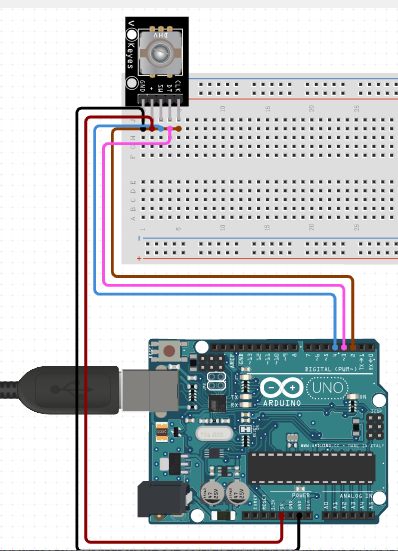

# C0020-Rotary Encoder Module

Rotary encoders are a type of position sensor that convert the angular position (rotation) of a knob into an output signal that can be used to determine which direction the knob is turned. There are two types of rotary encoders: absolute and incremental. Absolute encoders report the exact position of the knob in degrees, whereas incremental encoders report the number of increments the shaft has moved.

## Image

## How to Connect to a Circuit

The pinout of the rotary encoder module is as follows:

- GND is the ground connection.
- VCC is the positive supply voltage, which is typically between 3.3 and 5V.
- SW is the output of the push button switch (active low).
- When the knob is depressed, the voltage goes LOW.
- DT (Output B) is similar to CLK output, but it lags behind CLK by a 90-degree phase shift. This output is used to determine the direction of rotation.
- CLK (Output A) is the primary output pulse used to determine the amount of rotation. Each time the knob is turned in either direction by just one detent (click), the CLK output goes through one cycle of going HIGH and then LOW.
 To wire a rotary encoder to an Arduino, connect the following pins:

- Rotary Encoder CLK pin to Arduino Digital Pin 2
- Rotary Encoder DT pin to Arduino Digital Pin 3
- Rotary Encoder SW pin to Arduino Digital Pin 4
- Rotary Encoder + pin to Arduino 5V
- Rotary Encoder GND pin to Arduino GND

## Theory Behind the Components

When you turn the knob, A and B make contact with common ground pin C in a specific order depending on which direction you turn the knob. When they make contact with common ground, two signals are 90 degrees out of phase because one pin makes contact with common ground before the other. This is referred to as quadrature encoding.

By monitoring when each pin connects or disconnects from ground, we can determine the direction in which the knob is being rotated. This can be accomplished by simply observing the state of B when A's state changes. When A changes state:

- If B!=A, then the knob is turned clockwise.
- If B=A, the knob is turned counterclockwise.

## Features

- Rotary encoders are the modern digital equivalent of potentiometers and are more versatile.
- Rotary encoders can rotate 360 degrees without stopping, whereas potentiometers can only rotate 3/4 of the circle.
- Potentiometers are used in situations where you need to know the exact position of the knob.
- Rotary encoders, on the other hand, are used in situations where you need to know the change in position rather than the exact position.

## Statistics

- We are surrounded by rotary encoders without even realizing it, as they are used in so many everyday items, from printers and cameras to CNC machines and robots.
- The most common application of a rotary encoder is the volume knob on a car radio.
