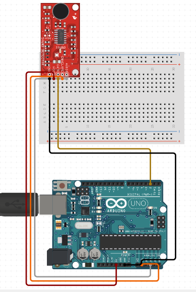

# C0012-Sound sensor

## Introduction

- A Sound Sensor is an electronic device that detects sound waves in a particular area. The sensor uses a microphone to detect sound and sends the output to an op-amp, which amplifies the signal and converts it to a digital or analog output. The sound level set point can be adjusted using a potentiometer on the module.

## Image

## How to connect to a circuit

To connect a Sound Sensor to a circuit, you need to connect the following components:

- The VCC pin of the module to the positive (+) rail of the breadboard.
- The GND pin of the module to the negative (-) rail of the breadboard.
- The DOUT pin of the module to a digital input pin of the Arduino.
- The AOUT pin of the module to an analog input pin of the Arduino.
- The theory behind the components
- The microphone detects sound waves and converts them to an analog signal, which is fed into an op-amp for amplification and conversion to a digital or analog output. The potentiometer on the module allows you to adjust the sound level set point.

## Features

Some of the key features of a Sound Sensor include:

- Detects sound waves in a particular area
- Converts the signal to a digital or analog output
- Adjustable sound level set point via a potentiometer
- Can be used for a variety of applications, such as turning lights on and off with clapping or detecting the presence of sound in an environment

## Statistics

- Sound sensors are widely used in the fields of security, automation, and entertainment. They can be used to detect and monitor sound levels in an environment, which can be useful in ensuring the safety and security of people and property. Sound sensors are also used in the entertainment industry for recording and amplifying sound.