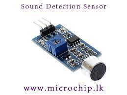
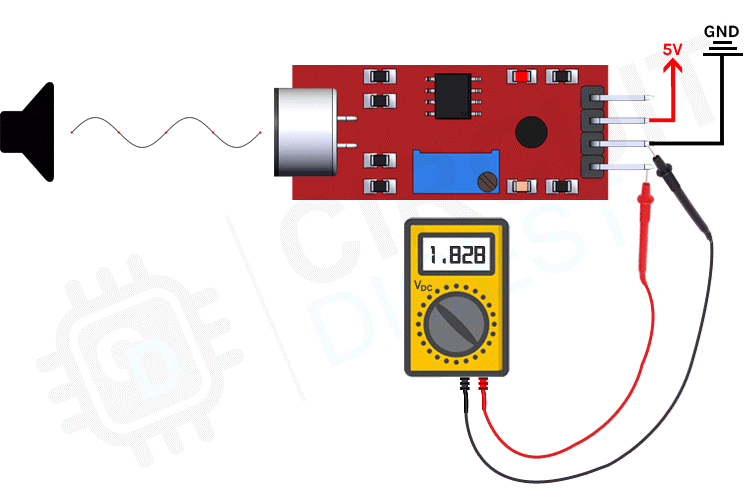

# Sound Sensor

- Arduino sound detection sensor.
- This module allows you to detect when sound has exceeded a set point you select.
- Sound is detected via a microphone and fed into an LM393 op amp.
- The sound level set point is adjusteed via an on board piontiometer.
- Sound sensors can be used for a variety of things,one of them could be turning light off and on by clapping.
- This module allows you to detect when sound has exceeded a set point you select.
- Sound is detected via a microphone and fed into an LM393 op amp.
- The sound level set point is adjusted via on board pointiometet.
- When the sound level exceeds the set point,an LED on the module is illuminated and the output is sent low.
   
  
   
- The sound sensor module has 4 pins.
- VCC, GRD, Digital out and Analog Out.
- We can either use the AO pin as an output for analog reading or the DO pin as an output for digital readout.
- Sound sensor pinout is as follows.
   
   
  
   
   
- VCC- connected to 3.3V or 5V
- GRN- connected to the ground pin
- DOUT- is the digital output pin of the board,low output indicates that no sound is detected by sensor, and high indicates that sensor has detected sound.
- AOUT- is the Analog output pin of the board that will give us an analog reading directly from the Sound Sensor.

## The working process of this module

- The microphone gives out only analog signal when sound wave hits the diapharagm of the sensor, this analog signal gets the processed by the op-amp and we get the digital output.
   
   
  
