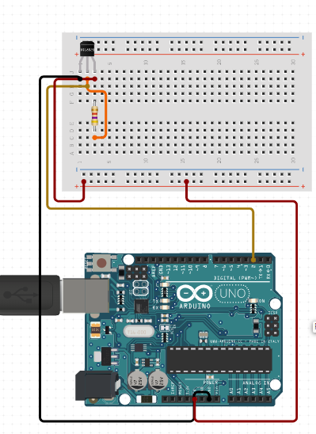

# C0003-Temperature sensor

## Introduction to temperature sensors
Temperature sensors are devices used to measure the temperature of an object or an environment. They are widely used in various applications, including weather forecasting, industrial processes, HVAC (heating, ventilation, and air conditioning) systems, medical devices, and consumer electronics. Temperature sensors provide valuable data for controlling and monitoring processes, ensuring safety, and optimizing efficiency.

There are several types of temperature sensors, each with its own working principle:
## Thermocouples:
Thermocouples are made by connecting two different metal wires at one end. When there is a temperature difference between the two ends, it creates a voltage that can be used to measure the temperature.

## Resistance Temperature Detectors (RTDs):
RTDs are temperature sensors made of pure platinum, which changes resistance with temperature. The resistance increase is proportional to the temperature change, allowing precise temperature measurements.

## Thermistors:
Thermistors are temperature-sensitive resistors whose resistance changes significantly with temperature. They can be classified into two types: NTC (Negative Temperature Coefficient) thermistors, where resistance decreases with temperature, and PTC (Positive Temperature Coefficient) thermistors, where resistance increases with temperature.

## Infrared Temperature Sensors:
These sensors measure the infrared radiation emitted by an object and calculate its temperature based on the emitted radiation. They are commonly used for non-contact temperature measurements.

## Bimetallic Temperature Sensors:
Bimetallic strips consist of two different metals bonded together. When heated or cooled, the metals expand or contract at different rates, causing the strip to bend. This bending can be used to measure temperature changes.

## Digital Temperature Sensors:
These sensors use digital interfaces like I2C or SPI to communicate temperature readings. They often integrate an analog sensor with an analog-to-digital converter and signal processing circuitry.

Temperature sensors play a crucial role in various industries, enabling precise temperature control and ensuring the safe operation of equipment and processes.

## Image

## How to connect to a circuit

- Pin 1 of the temperature sensor is connected to DC 5V.
- Pin 2 is connected to any analog signal pin on the Arduino board.
- Pin 3 is connected to the GND pin on the board.

## The theory behind the components

The temperature sensor converts the surrounding temperature to voltage using a thermistor, which is a type of resistor that changes its resistance with temperature. As the temperature increases, the resistance of the thermistor decreases, which causes an increase in the voltage output of the sensor. This voltage output is then converted to Fahrenheit using a formula and displayed on an LCD.

## Features

Temperature sensors have a wide range of applications across various industries due to their ability to measure temperature accurately. Here are some common uses of temperature sensors:

## Climate Control:
Temperature sensors are used in heating, ventilation, air conditioning (HVAC) systems to regulate indoor temperatures in buildings, ensuring comfort and energy efficiency.

## Industrial Processes:
Temperature sensors are crucial in industrial applications such as manufacturing and chemical processing. They monitor equipment temperature, ensuring safe and efficient operation.

## Food Industry:
Temperature sensors are used in food processing and storage to maintain appropriate temperatures, ensuring food safety and quality.

## Medical Devices:
Temperature sensors are integrated into medical devices like thermometers and incubators to monitor body temperature or create controlled environments for medical procedures.

## Automotive: Temperature sensors are used in vehicles to monitor engine temperature, cabin temperature, and outside air temperature. They help prevent engine overheating and ensure passenger comfort.

## Environmental Monitoring: Temperature sensors are used in weather stations and environmental monitoring systems to collect climate data for research and weather forecasting.

## Energy Management:
Temperature sensors help optimize energy usage in systems like water heaters and HVAC systems, contributing to energy efficiency.

## Electronics:
Temperature sensors are integrated into electronic devices and computers to monitor the temperature of components, preventing overheating and ensuring proper functioning.

## Agriculture:
Temperature sensors are used in agricultural applications to monitor soil temperature, greenhouse temperature, and livestock environments. This information is vital for crop management and animal husbandry.

## Research and Laboratories:
Temperature sensors are used in research experiments and laboratories where precise temperature control is necessary for accurate results.

## Fire Detection:
Temperature sensors are used in fire alarm systems to detect rapid temperature increases, indicating a possible fire. Early detection is crucial for fire prevention and safety.

## HVAC Systems:
Temperature sensors are employed in various HVAC components like thermostats and duct sensors to control heating, cooling, and ventilation systems in buildings.

## Energy Production:
Temperature sensors monitor and control temperatures in power plants, ensuring safe and efficient energy production.

## Oil and Gas Industry: 
Temperature sensors are used in the oil and gas industry to monitor temperatures in pipelines, equipment, and refineries, ensuring safety and efficiency.

## Consumer Electronics:
Temperature sensors are integrated into smartphones, laptops, and other gadgets to monitor internal temperature and prevent overheating during operation.

## Statistics

- The accuracy of temperature sensors depends on the type and model, with some having accuracies of ±0.1°C and others having accuracies of ±1.5°C.
- They also have a response time, which is the time it takes for the sensor to detect a change in temperature, and can range from milliseconds to several seconds
