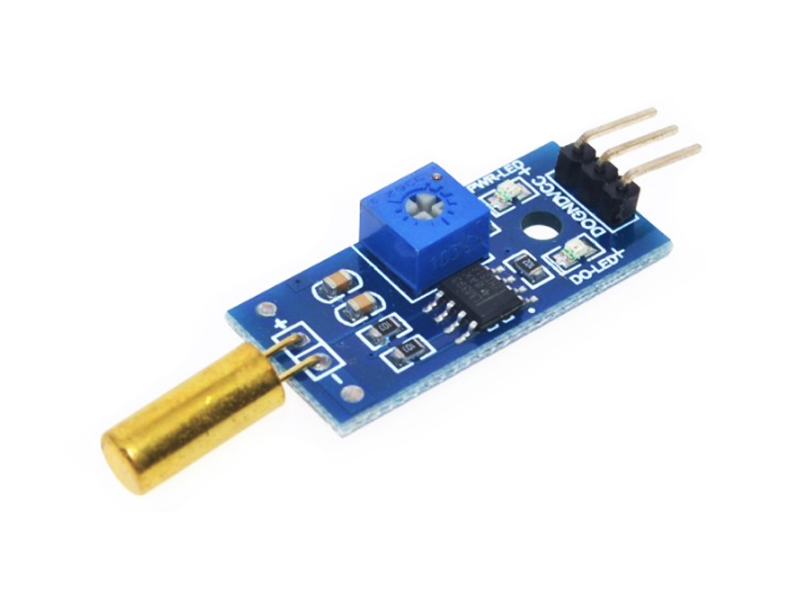
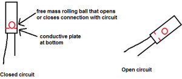
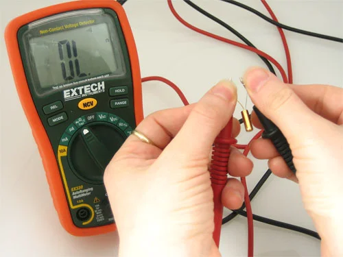
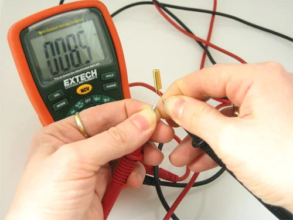

# Tilt Sensor
- The pair Air show is one of the biggesr shows for airplane manufacturers.Some of the valiant pilots perform amazing stunts to showcase the speed of their planes.These pilots use the power of the super-fast machinery of planes to make their stunts better for their support.A tilt sensor is one of the critical parts of the computer assisted circuitry, and it is a type of transducer.
- This sensor helps in giving information about the horizontal and vertical inclintion of the airplanes so that the pilot of the plane can easily understand the process of deadline with the obstacles during the flight.
- Thus transducers play an inportant role in decision making for pilots.
- such types of sensors produce an electrical signal which is proportional to the degree of inclination with respect to one or more axes.
- These sensors play a very important role in several applications such as off road vehicles,portable computers,robotics devices,aviation instruments, etc.

- Tilt sensors are devices that produce an electrical signal that varies with an angular movement.
- These sensors are used to measure slope and tilt within a limited range of mortion.
- Sometimes, the tilt sensors just generate a signal but inclinometers generate both readout and a signal.
## Title Sensor Working Principle

- These sensors consist of a rolling call with a conductive plate beneath them.
- When the sensor gets power, the rolling ball falls to the bottom of the sensor to form an electrical connection.
- When the sensor is titled,the rollinf ball doesn't fall to the bottom so that the current cannot flow the two end terminals of the sensor. 
## Types of Tilt Sensors.
- These sensors are classified into different type and the classification of these sensors includes different devices and technologies to measure tilt,slope elevation and inclination.
1. Force Balance Sensor
2. MEMS Sensor
3. Fluid filled Sensor

## Specification
<table>
<tr>
<td>I/O Pins</td>
<td>Digital Output</tr>
</tr>
<tr>
<td>Length x Width</td>
<td>30mm x 16mm</tr>
</tr>
<tr>
<td>Operating Voltage</td>
<td>3.3V~5V</tr>
</tr>
<tr>
<td>Sensitivity</td>
<td>15~45 degrees</tr>
</tr>
</table>
 
 
 ## Testing the Tilt Sensor

 
## Application of Tilt Sensor
- Cameras
- Video Cameras
- Aircraft Flight Control
- Consteucion Equipmnent
- Robotic Technology
- Automoble Air Bags
- Video Game Controllers
- Studying Human Movement
- Thermostats
- Automobile Security Systems 