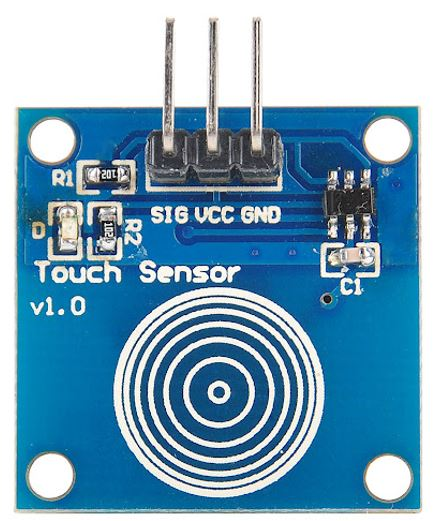
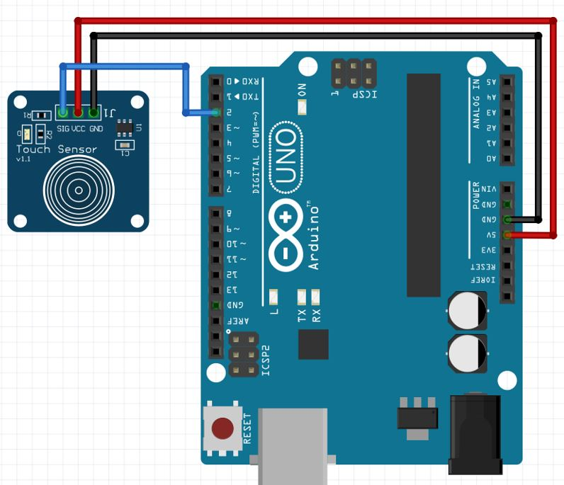
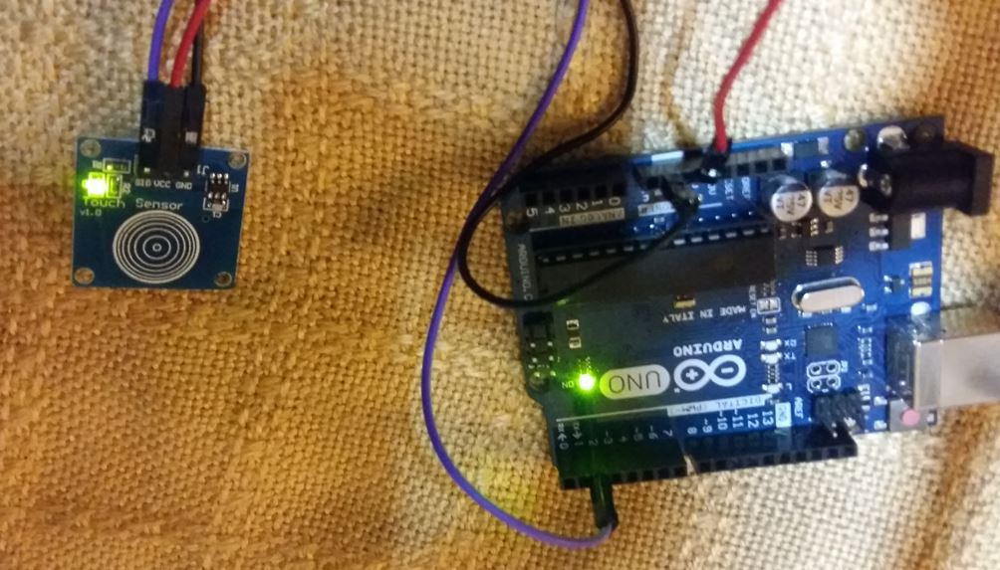

# Touch Sensor

- The digital Touch sensor module TTP223B is a low priced sensor that is compact and fairly easy to use.
- It is commonly used to control devices where touch detected.
- In simple ways,it acts as a button and has the same feature.The working principle of touch sensor is like a switch.
- The resistive touch sensor consists of two conductive and a single non-conductive layer.
- What happens is that the outside conductive layer and the inner layer get in contact which produces changes in voltage.
- When pressure is applied to its surface(touch) then the circuit allows the current to flow through it.
- The change in capacitance is used to detect the touch.It is made up of an Electrode film which is on top of a glass panel.The glass panel has a printed circuit pattern which is conductive in nature.
- When pressure is applied to the touch sensor's surface,the output signal is HIGH otherwise it is LOW.
- It goes in Low power mode if no one touches the sensor for a few seconds.
- Some key advantages of using touch sensors are that they were very cost efficient and compact in nature.
- They do not consume a lot of power and can be easily be integrated with microcontrollers to control devices in touch detection.
- However,it requires proper amount of pressure in order to detect the touch.

## Pinout

- The touch sensor as you can see in the picture above consists of only three pins.
- The SIG pin is connected with the digital pin of Arduino board.This will be set up as an input.
- When pressure will be applied sensors surface,the signal will be 1 or HIGH.other wise it will be 0 or LOW.
- The VCC pin is connected with the power pin of the Arduino.
- The touch sensor module supports 2.0-5.5V DC power supply.We will connect this pin with Arduino 5V pin.
- The GND pin is connected with the GND of the Arduino board.

- The connections of both the devices are fairly simple.Just connect the SIG pin of the sensor module with any appropriate digital pin of the Arduino board.

