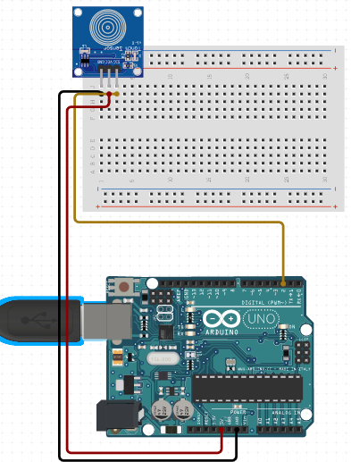

# C0039-Touch Sensor

The TTP223B touch sensor module is a compact and low-cost sensor commonly used to detect touch and control devices. It works similar to a button and has a simple working principle.

## Image

## How to connect to a circuit

Connect the SIG pin to a digital pin of the Arduino board, the VCC pin to the power pin of the Arduino board (2.0-5.5V DC), and the GND pin to the GND of the Arduino board.

## The theory behind the components

The touch sensor uses a resistive touch technology, which consists of two conductive layers and a non-conductive layer. When pressure is applied to the surface, the outside conductive layer and the inner layer get in contact, producing changes in voltage. The change in capacitance is used to detect the touch. It is made up of an electrode film which is on top of a glass panel. The glass panel has a printed circuit pattern which is conductive in nature.

## Features

- The touch sensor is cost-efficient, compact, and consumes low power. 
- It can be easily integrated with microcontrollers to control devices in touch detection.
- It goes into low power mode if no one touches the sensor for a few seconds.

## Statistics

- The touch sensor module has only three pins and supports 2.0-5.5V DC power supply. 
- It is commonly used in various electronic projects, including robotics, home automation, and interactive displays. 
- However, it requires proper pressure to detect touch.
