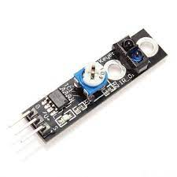
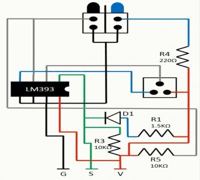

# Tracking Sensor
- KY-033 Lne Tracking sensor-A line tracking sensor and it does exactly what the name suggests it tracks black lines against white background or white lines against black background whether you would like to do and it's a pretty simple device.
- This sensor is also known as hunt sensor or line following sensor.
- This sensor consists of IR.This is basically obstacle sensing module having built-in receiver and transmitter that senses the IR energy and looks for the reflected IR energy to detect the obstacle in front of sensor module.
- The sensor returns the status of the IR light reflected from the surface.
- When this line tracking sensor is on a black surface then all of the radiation that been transmitted gets absorbed by the surface and nothing is reflected onto the sensor and so we get a zero output signal and when it is white surface the ipposite happens all the radiation that transmitted off the transmitter is being detected by the receiver amd then we get a positive signal or digital one.
- There is a knob that you can use it goes from one to three and you can this to adjust the sensitivity of the line tracking sensor.
- It consists of three pins which one pin is ground,one is VCC and other pin is the output of the sensor.

## Specification 
- Working voltage: DC 3.3V-5V
- Working Current:>=20mA
- Operating Temperature:-10C~+50C
- Detection distance:2-40cm
- IO interface:3-Wire interfaces
- Output Signal: TTL level 
- Adjustment:adjust multi- turn resistance.
- Effective angle:35`
## Inside the KY-033 line trackong sensor:

 
- This module has integrated onboard a line tracker,on board build-in potentiometer which will be used to adjust the direction range,one micrometer, four resistors and one led.
- The potentionmeter is used to calibrate the sensor.
- The sensor has very good ambient response even in complete darkness.
- The resistor R1 used in this module is 1.5K ohoms,resistor R3 is 10K ohom,resistor R4 is 220 ohms and resistor R5 is 10K ohm and the main reason for using the resistor is to limit current circulating inside the module.
## KY-033 Line Tracking sensor with the Arduino:
- So let's go head and connect this line tracking sensor with the Arduino Uno and now connect the output pin of the sensor with digital pin 8 of the Arduino.
- Now connect the ground of the sensor with the ground of Arduino and VCC with the 5V of the Arduino.

 
- When we will plug the sensor with the Arduino it will start blinking but the blue light only blinking when put hand close to the sensor.This led shows the status of the sensor.
## Working of the sensor

