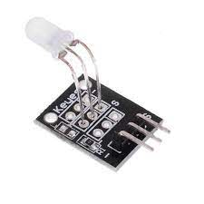
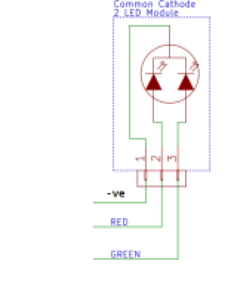

# Two Color LED Module

- A two color LED or sometimes called a double colour LED is a light emitting diode that emits 2 different colors of light commonly the red and green.
- It is a semiconductor diode which light up when voltage is applied.
- Using a PWM, you can manipulate the intensities of each color.

- As we can see on the image above,this module has 3 pins;the GND,the RED and the GREEN.
- This component is a common cathode module as the cathode of the LED are affixed and found in a single common pin.

## How does a Double Colour LED work?

- The double colour LED has 2 terminals or pins,and are connected back to back;Anode to Cathode.
- Once a positive voltage is directly supplied to the terminal,for example on the green anode,it will emit light,and this also applied to the Red anode.

- Only 1 LED can receive positive voltage at a time because of the 2 terminal system resulting in a limited range of colors.
- Now that we know this type of LED works,let us get to setting it up on Arduino Uno.

## Two Colour LED Wiring

