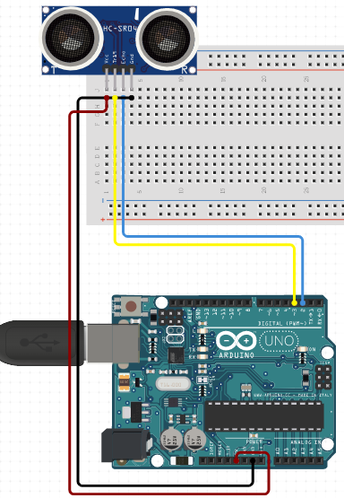

# C0015-Ultrasonic Distance Sensor

## Introduction to Ultra sonioc sensor

An ultrasonic distance sensor, also known as an ultrasonic ranging module or ultrasonic sensor, is a type of sensor that measures the distance between the sensor and an object using ultrasonic waves. These sensors use the principle of echolocation, similar to how bats, dolphins and Beluga whales navigate by emitting sound waves and measuring the time it takes for the waves to bounce back after hitting an object.

## How Ultra sonic sensors work 

- Transmitter 
--The sensor emits a short ultrasonic pulse.

- Traveling of the Pulse
--This pulse travels through the air and hits an object.

- Reflection of the Pulse 
--The pulse bounces back off the object and returns to the sensor.

- Receiver 
--The sensor's receiver detects the reflected pulse.

- Calculation of Distance 
--By knowing the speed of sound in the air (which is approximately 343 meters per second or 1125 feet per second at room temperature), the sensor can calculate the time it took for the pulse to travel to the object and back. Using this time and the speed of sound, the sensor can calculate the distance to the object.

## Image

## How to connect to a circuit

To connect the HC-SR04 ultrasonic distance sensor to an Arduino or other microcontroller, you need to connect the VCC and GND pins to the 5V and GND pins on the board respectively. You also need to connect the Trig and Echo pins to any digital input/output pins on the board.

## The theory behind the components

The HC-SR04 ultrasonic distance sensor works by sending an ultrasonic sound wave at a frequency of 40000Hz, which travels through the air and bounces back to the sensor when it encounters an obstacle or object. The sensor then calculates the distance based on the travel time of the sound wave and the speed of sound.

## Features

The HC-SR04 ultrasonic distance sensor has the following features:

- Operating voltage: 5V DC
- Operating current: 15mA
- Operating frequency: 40kHz
- Minimum range: 2cm/1 inch
- Maximum range: 400cm/13 feet
- Accuracy: 3mm
- Measuring angle: 15 degrees
- Dimension: 45 x 20 x 15mm

## Statistics

- The HC-SR04 ultrasonic distance sensor is a widely used sensor in robotics, automation, and other applications that require accurate distance measurements. 
- It is easy to use, affordable, and provides accurate measurements with a high resolution of 3mm.
