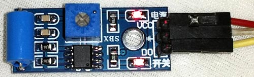
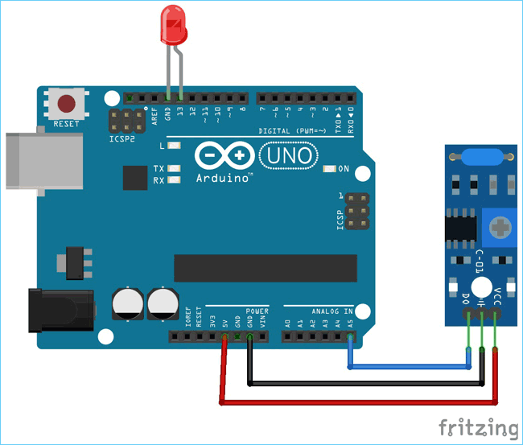

# The Vibration sensor

- There are sevaral critical machines or expensive equipment which suffer damages due to vibrations.
- In such a case,a vibration sensor is required to find out whether the machine or equipment is producing vibration or not.
- Identifying the object which is continuously vibrating is not a tricky job if the proper sensor is used to detect the vibration.
- There are several types of vibration sensors available in the market which can detect the vibration bys sensing acceleratiom or velocity and could provide excellent resuilt.
- however, such sensor are too expensive where the accelerometer is used.
- Accelerometer is very sensitive and can be used to make Earthquake detector circuit.
- But, there are few dedicated and cheap sensors are also available to detect the vibrations only,one such vibration sensor is SW-420 which we are going to interface with Arduino Uno.
- So in this project,a basic vibration sensor detects any vibration or jerk an LED will start blinking.

## Vibration Sensor Module SW-420

- This is an SW-420 Vibration module,which work from 3.3V to the 5V.
- The sensor used LM393  comparator to detect the vibratuin over a threshold point and provide digital data,logic low and when the vibration is detected,the sensor provide logic High.
- There are three peripherals available in the module, two LED's one for the power state and other peripherals availavle in the module,two LED's one for the power state and other for the sensor's output.
- Additionally, a potentiometer is available which can be further used to control the threshold point of the vibration.

- The LED is connected in the D13 pin.
- The module is powered using the available 5V pin in the Arduino.
- The Ground and the 5V pin are used to power up the Arduino whereas the A5 pin is used to get the data from the vibration sensor.
