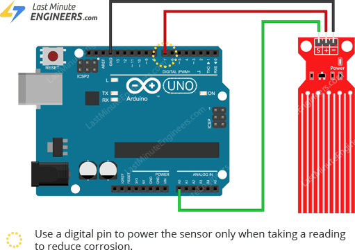

# Water level Sensor

- The sensor has ten exposed copper traces, five of which are power traces and the remaining five are sense traces.
- These trace are interlaced so that there is one sense trace between every two power traces.
- Normally, power and sense traces are not connected, but when immersed in water, they are bridged.

## How it works?

- The power and sense traces form a variable resistor(much like a potentiometer)whose resistance varies based on how much they are exposed to water.

  -The resistance varies inversely with the depth of immersion of the sensor in water.
  - The more water the sensor is immersed in,the  better the conductivity and the lower the resistance.
  - The less water the sensor is immersed in,the poorer the conductivity and the higher the resistance.
- The sensor generates an output voltage proportional to the resistance; by measuring this voltage, the water level can be determined.  

## Water level sensor pinout

- S (signal) is an analog output pin that will be  connected to one of your Arduino's analog inputs.
- +(VCC) pin provides power to sensor.It is recommended that sensor be powered from 3.3V to 5V.
- -(GND) is the ground pin.

