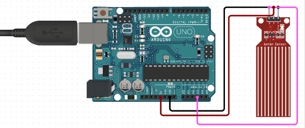

# C0014-Water Level Sensor

## Introduction

- A water level sensor is a device used to detect and measure the water level in a tank or other container. It can be used in various applications, such as monitoring water levels in aquariums, controlling water pumps, or detecting flooding in a basement.

## Image

## How to connect to a circuit

- The water level sensor has three pins: VCC, GND, and S (signal). To connect it to an Arduino circuit, you need to connect the VCC pin to the 3.3V or 5V pin on the Arduino, the GND pin to the GND pin on the Arduino, and the S pin to an analog input pin on the Arduino. Here's an example wiring diagram:

## The theory behind the components

- The water level sensor works by using interlaced copper traces to form a variable resistor. The resistance varies based on how much the traces are exposed to water. The more water the sensor is immersed in, the better the conductivity and the lower the resistance. The less water the sensor is immersed in, the poorer the conductivity and the higher the resistance. The sensor generates an output voltage proportional to the resistance, which can be measured by an Arduino or other microcontroller to determine the water level.

## Features

- 10 exposed copper traces (5 power and 5 sense)
- Interlaced design with one sense trace between every two power traces
- Variable resistor design based on water immersion
- Analog output signal
- Can be powered from 3.3V to 5V

## Statistics

-There are various types and models of water level sensors available on the market, with different features, specifications, and prices. Some common statistics that you may consider when choosing a water level sensor include:

- Input voltage range: 3.3V to 5V
- Output voltage range: 0V to VCC
- Sensitivity: typically around 20-200 mV per inch of water level change
- Accuracy: depends on the model and calibration, but usually within a few percent
- Response time: varies depending on the immersion depth and the design of the sensor, but usually within a few seconds to a few minutes
- Operating temperature range: depends on the model and the environment, but usually between -10°C to 85°C
Price: varies depending on the brand, model, and supplier, but usually between a few dollars to tens of dollars
